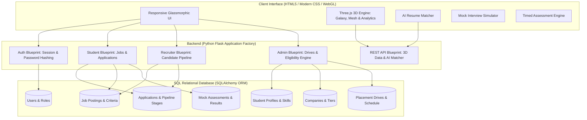

# 🎓 Student Placement Management System 3D (PlacementHub 3D)

[](https://python.org)
[](https://flask.palletsprojects.com/)
[](https://www.sqlalchemy.org/)
[](https://threejs.org/)
[](LICENSE)

An intelligent, full-stack campus recruitment and placement automation platform engineered to streamline university placement drives, eliminate manual spreadsheets, and elevate candidate preparation through **interactive 3D WebGL visualizations** and **AI skill gap analytics**.

---

## 🌟 Key Highlights & Core Capabilities

- **Automated Recruitment Operations:** Automates student drive registrations, eligibility checks, and shortlist broadcasts, reducing manual administration by over 80%.
- **Secure Role-Based Authentication:** Dedicated portals and permissions for **Students**, **Company Recruiters**, and **Placement Directors / Admins**.
- **Interactive 3D WebGL Career Visualizer:**
  - **3D Career Galaxy & Recruiting Satellites:** Orbital Three.js scene mapping hiring companies, compensation tiers, and live package statistics.
  - **3D Student Skill Polyhedron:** Dynamic 3D crystal deforming according to verified technical proficiencies.
  - **3D Holographic Placement Analytics:** 3D bar/cylinder charts visualizing department placement percentages and salary cohorts.
- **AI Resume & Skill Gap Analyzer:** Real-time alignment algorithm comparing candidate skills against job requirements, calculating match percentages, detecting missing proficiencies, and suggesting actionable study roadmaps.
- **Timed Mock Interview Simulator:** Practice real Data Structures, Algorithms, System Design, and Behavioral HR questions under a 3-minute timer with STAR method hints and model answers.
- **Multi-Round Pipeline Tracker:** Visual step tracker following applications from `Applied` &rarr; `Shortlisted` &rarr; `Aptitude Test` &rarr; `Technical Interview` &rarr; `HR Interview` &rarr; `Offered / Accepted`.
- **Eligibility Engine & 1-Click CSV Export:** Filter student cohorts by minimum CGPA, maximum backlogs, and branch eligibility, with instant CSV download ready for visiting HR teams.
- **Online Aptitude & Coding Quizzes:** Timed practice assessments with instant score calculation, percentage grading, and in-depth answer explanations.

---

## 🏗️ System Architecture



---

## 💻 Tech Stack & Techniques

| Component | Technology | Description |
| :--- | :--- | :--- |
| **Backend Framework** | Python 3.10+, Flask 3.1 | Modular architecture with Blueprints and Application Factory |
| **Database & ORM** | SQLite, SQLAlchemy 2.0 | Relational database schema with foreign keys and cascade rules |
| **Security & Auth** | Werkzeug Security | PBKDF2/SHA-256 password hashing and role-based session guarding |
| **3D Graphics & WebGL** | Three.js (r128) | Interactive 3D scene, raycasting tooltips, particle systems, dynamic meshes |
| **Frontend UI/UX** | HTML5, Modern CSS3, Jinja2 | Glassmorphism design system, responsive flex/grid, micro-animations |
| **Client Scripting** | Modern JavaScript (ES6+) | Asynchronous fetch API, interactive timers, modal handlers |
| **Data Export** | Python `csv` module | Dynamic CSV generation with HTTP disposition headers |

---

## 📂 Project Directory Structure

```
Student-Placement-Management-System-3D/
├── app.py                      # Flask Application entry point & factory
├── config.py                   # App configurations (DB URI, secret key, uploads)
├── models.py                   # SQLAlchemy ORM models (10 relational models)
├── seeds.py                    # Database seeder with realistic colleges, companies, students
├── requirements.txt            # Python dependencies
├── .env.example                # Sample environment variables
├── .gitignore                  # Git ignore rules for Python & SQLite
├── README.md                   # Comprehensive project documentation
├── routes/
│   ├── __init__.py
│   ├── auth.py                 # Login, Register, Logout, Demo Quick Login
│   ├── main.py                 # Public landing page with 3D Galaxy & stats
│   ├── student.py              # Student portal, job board, applications, tools
│   ├── recruiter.py            # Recruiter workspace, job publisher, candidate pipeline
│   ├── admin.py                # Director console, eligibility filter, CSV export, reports
│   └── api.py                  # JSON REST endpoints for 3D scenes & AI resume matching
├── static/
│   ├── css/
│   │   └── style.css           # Glassmorphism styling, responsive design system
│   └── js/
│       ├── main.js             # UI controls, mobile menu, toast alerts
│       ├── three_scene.js      # Three.js 3D Career Galaxy & Recruiting Satellites
│       ├── three_analytics.js  # Three.js 3D Holographic Placement Analytics Charts
│       ├── three_skill_mesh.js # Three.js 3D Student Skill Polyhedron / Radar
│       ├── resume_matcher.js   # AI Resume & Skill Gap Analyzer client tool
│       └── mock_interview.js   # Interactive Mock Interview Simulator with timer
└── templates/
    ├── base.html               # Master layout template with navbar, footer & Three.js
    ├── index.html              # Landing page with 3D canvas and partner showcase
    ├── auth/
    │   ├── login.html          # Login page with 1-click demo switcher
    │   └── register.html       # Student and recruiter account registration
    ├── student/
    │   ├── dashboard.html      # Student hub with 3D skill mesh & active drives
    │   ├── jobs.html           # Campus job board with multi-attribute filtering
    │   ├── job_detail.html     # Role details with instant AI Skill Gap breakdown
    │   ├── applications.html   # Visual multi-round recruitment tracker
    │   ├── profile.html        # Student academic record & skill profile editor
    │   ├── resume_analyzer.html# Dedicated AI Resume & Skill Gap Analyzer
    │   ├── mock_interview.html # Timed technical & HR mock interview simulator
    │   ├── assessments.html    # Practice assessments directory
    │   └── take_assessment.html# Timed MCQ test interface with instant score calculation
    ├── recruiter/
    │   ├── dashboard.html      # Recruiter overview & active job listings
    │   ├── post_job.html       # Publish campus drive opening with eligibility constraints
    │   └── applicants.html     # Candidate pipeline manager with round advancement modal
    └── admin/
        ├── dashboard.html      # Director console with 3D Holographic analytics chart
        ├── students.html       # Student directory & eligibility engine with CSV export
        ├── companies.html      # Corporate partners directory & tier management
        ├── drives.html         # Campus drive scheduler
        ├── announcements.html  # Official notice broadcast manager
        └── reports.html        # Department-wise placement performance reports
```

---

## 🚀 Quick Start & Installation

### 1. Clone the Repository
```bash
git clone https://github.com/Keerthishasrinivasan/Student-Placement-Management-System-3D.git
cd Student-Placement-Management-System-3D
```

### 2. Set Up Virtual Environment (Recommended)
```bash
python -m venv venv
# On Windows:
.\venv\Scripts\activate
# On Linux/macOS:
source venv/bin/activate
```

### 3. Install Dependencies
```bash
pip install -r requirements.txt
```

### 4. Initialize & Seed Database
Populate database with realistic companies (Google, Microsoft, Amazon, Cisco, etc.), student profiles across branches, job postings, and quizzes:
```bash
python seeds.py
```

### 5. Run the Application
```bash
python app.py
```
Open your browser and navigate to:
```
http://127.0.0.1:5000
```

---

## 🔑 Demo Accounts for Instant Evaluation

The portal includes a **1-Click Demo Login bar** on the sign-in page for evaluation:

| Role | Email | Password | Access Highlights |
| :--- | :--- | :--- | :--- |
| **Student (CSE)** | `arun.cse@university.edu` | `Student@123` | CGPA 9.35, Google 44.5 LPA Offer, 3D Skill Polyhedron |
| **Student (IT)** | `priya.it@university.edu` | `Student@123` | CGPA 8.82, Active Technical Interview with Microsoft |
| **Placement Director** | `placement.director@university.edu` | `Admin@123` | 3D Holographic Analytics, Eligibility Engine, CSV Export |
| **Recruiter (Google)**| `campus.hire@google.com` | `Recruiter@123` | Candidate Pipeline Management, Stage Advancement |

---

## 🌐 REST API Endpoints

- `GET /api/3d-arena-data`: Fetches 3D spatial node coordinates, company tiers, and package stats for Three.js scene.
- `GET /api/3d-analytics`: Returns department placement percentages and salary cohort counts for 3D holographic cylinders.
- `GET /api/student-skills/<id>`: Returns 5-dimensional skill vector for 3D polyhedron deformation.
- `POST /api/analyze-resume`: Compares candidate skill keywords against job criteria, calculates fit percentage, and returns missing skills with recommendations.

---

## 📜 License

This project is licensed under the MIT License - feel free to use and adapt for academic and recruitment purposes.
